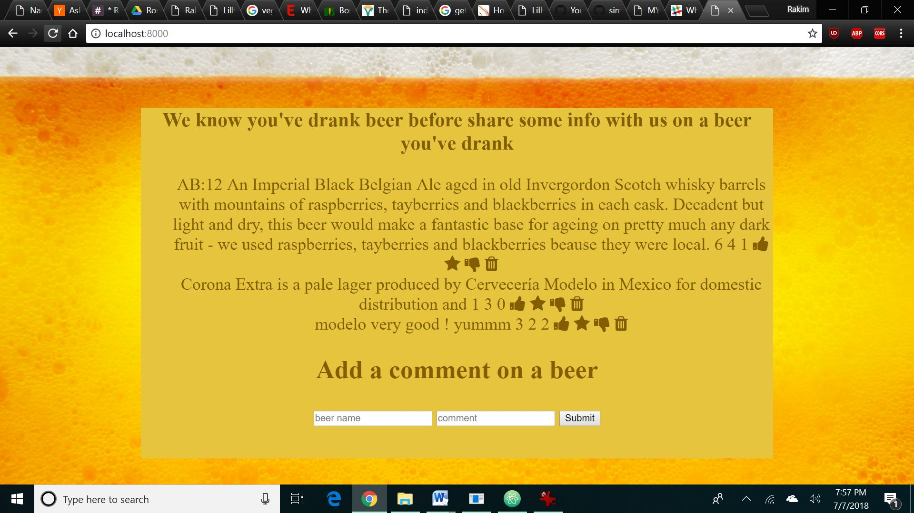

## Installation

1. Clone repo
2. run `npm install`

## Usage

1. run `node server.js`
2. Navigate to `localhost:8000`

My express project incorporating a previously built project

This project I had to make an app that used express but incorporated a previous project of some kind. I previously used an API that displayed information about beers in one of my other apps so I decided to use that. I would create a form that allowed users to input a beer and a fun fact about the beer along with the ability to give it a star if they really
liked it, thumbs up if they liked it or thumbs down if they didn't like it.

Demo:

How It's Made:
Tech used: HTML, CSS, Javascript, Node, Express, Mongo, Embedded Javascript

I started off by using Node and Express to create a server that my browser can connect to. After ensuring my server was up and running I created a form in Embedded Javascript that the user can input info to. After that I linked my Mongo database to the form so when information gets entered it also gets stored into the database.

Optimizations:
I hope to drink different beers so I can add more facts about different beers to the article. Jokes aside at first the app was only going to be able to give a thumbs up and thumb down but I opted to add a star rating also.

Lessons Learned: I created an express server, learned to execute CRUD operations, save and read from MongoDB and I also learned to use a template engine like Embedded JS. I also learned how to have more than a simple thumbs up and down as a rating for posts.

Examples:

Take a look at these couple examples that I have in my own portfolio:
